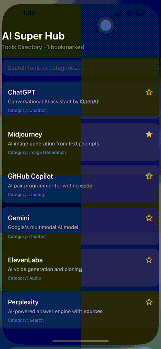

# AI Super Hub Mobile


A cross-platform mobile companion for [AI Super Hub](https://github.com/naikdivesh/ai-super-hub) — a React Native (Expo) app that lets users browse, search, and bookmark AI tools on their phone.

<!-- Drag your phone recording into the GitHub editor here; it will insert an image line like the one below -->


## Features
- **Tools directory** — a scrollable list of AI tools rendered efficiently with `FlatList`.
- **Live search** — filter tools by name or category as you type.
- **Bookmarking** — tap a tool to favorite/unfavorite it, with a live count in the header.

## Tech Stack
- **React Native** with **Expo** (SDK 54)
- **JavaScript**, React Hooks (`useState`)
- Core components: `FlatList`, `TextInput`, `TouchableOpacity`, `SafeAreaView`
- Styling with `StyleSheet` and Flexbox

## Key Concepts Demonstrated
- Component composition with props (a reusable `ToolCard`)
- State management with the `useState` hook and **immutable state updates**
- Controlled inputs and **derived state** (the filtered list is computed from state, not stored)
- "Lifting state up" — the parent owns the bookmark data; child cards report taps upward

## Getting Started
```bash
git clone https://github.com/naikdivesh/ai-super-hub-mobile.git
cd ai-super-hub-mobile
npm install
npx expo start
```
Then scan the QR code with the **Expo Go** app (Android) or the **Camera** app (iOS). Your phone and computer must be on the same Wi-Fi network.

## Author
**Divesh Naik** — M.S. Information Systems, Northeastern University
- GitHub: https://github.com/naikdivesh
- LinkedIn: https://www.linkedin.com/in/diveshnaik/

## License
Built as a personal learning project.